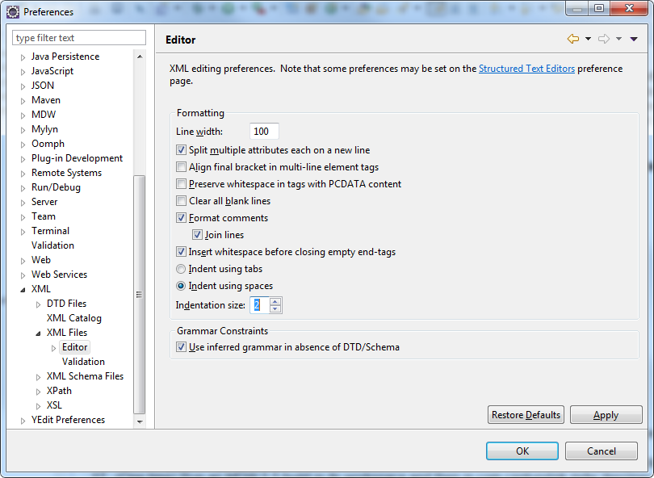
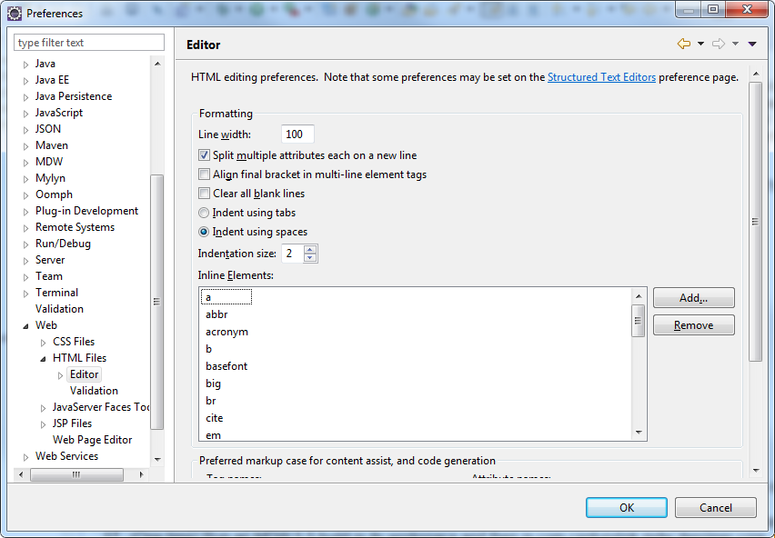
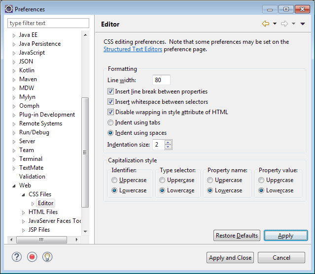
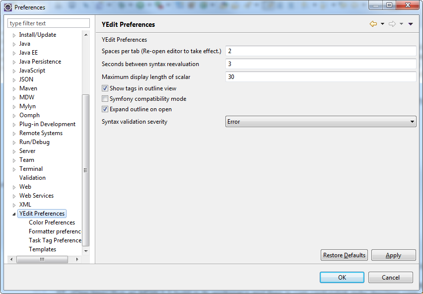

### Code Format

1. Java, Kotlin, Groovy, JavaScript and JSON:
     The Eclipse code formatters are version-controlled in .settings/org.eclipse.jdt.core.prefs, 
     so as long as you're up-to-date with Git you should automatically have the correct settings. 
     If you want to use them for another project, you can download and import them from these formatter files:   
     - Java/Kotlin/Groovy: https://github.com/CenturyLinkCloud/mdw/blob/master/docs/_docs/code/MDWCodeFormatter.xml   
     - Javascript/JSON: https://github.com/CenturyLinkCloud/mdw/blob/master/docs/_docs/code/mdw-javascript-formatter.xml   
     - Please note that we use **spaces instead of tabs** for indenting all source code.  Java, Kotlin and Groovy 
       are indented four spaces, whereas JavaScript and JSON are indented two spaces.
2. **Action Required**: XML, HTML, CSS and YAML:  
     These have to be configured manually in Eclipse.  For all formats we use **spaces instead of tabs**.
     The following screenshots illustrate how to set these:  
     - XML:                                                    
      
     - HTML:                                                           
      
     - CSS:                                      
      
     - YAML:                                      
      
3. As of MDW 6.1 the no-tabs rule is enforced by the build. 
