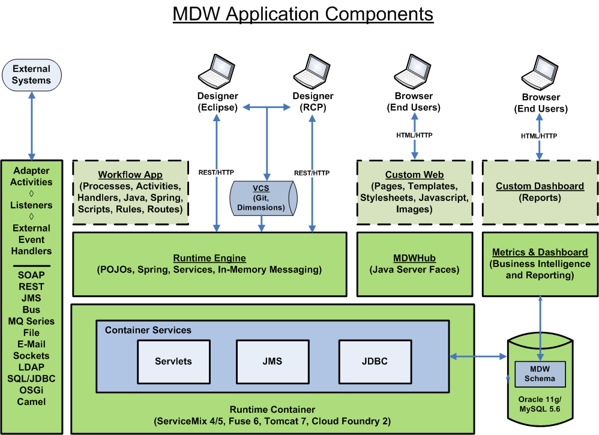

 - Runtime Engine 
 -- The behind-the-scenes nerve center in the cloud that executes all workflow processes.   
 - MDW Designer 
 -- The environment for building processes and tasks, with a graphical runtime view.  
 - MDWHub 
 -- The end-user webapp for handling manual tasks, with supervisor tools and integrated reports. 
 - Services Framework 
 -- The extensible service-oriented foundation for interacting with external systems. 
 - Business Intelligence 
 -- The design facility for identifying milestones and authoring reports to aggregate collected data.

    
    
    
