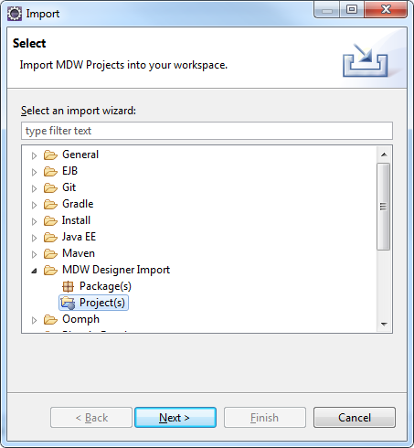
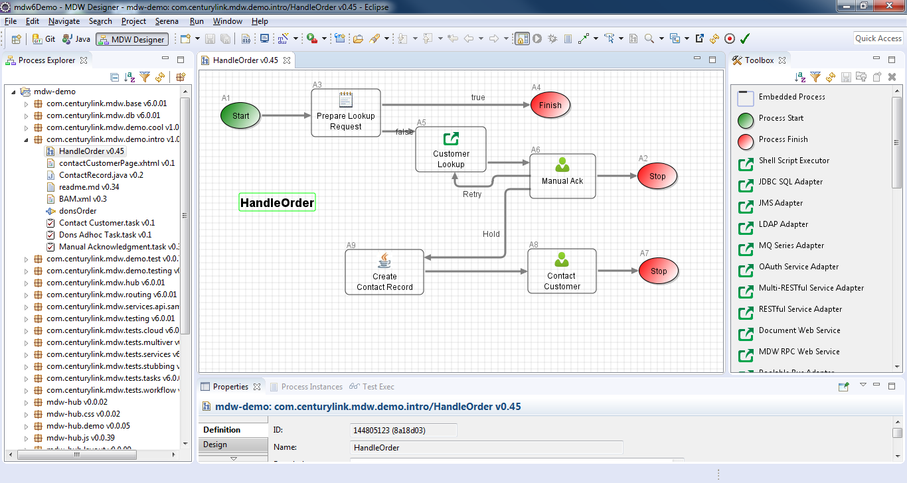
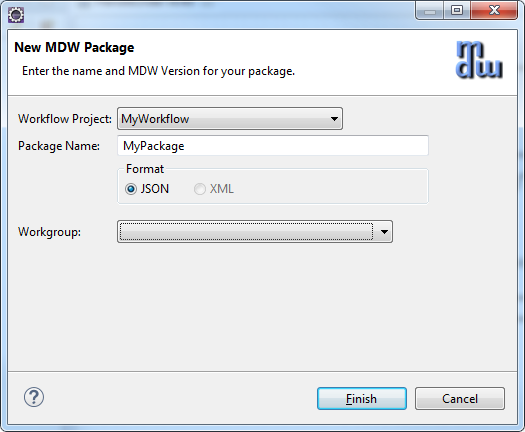
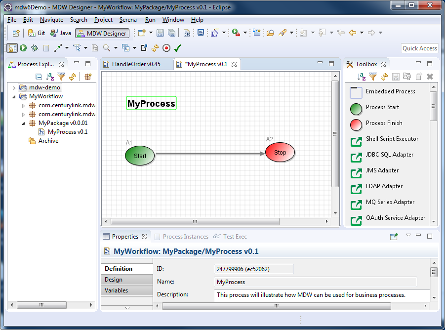

  

   
### MDW Designer User Guide

#### Getting Started with MDW Designer
- The MDW Designer application comes in two flavors: an Eclipse plug-in for developers, and a standalone program (Designer RCP) for business users, architects,  
  analysts, testers and support teams.  Both versions leverage the same codebase, with the main difference being that the standalone program does not require a 
  full-blown development setup.

- In addition to this document, there is a great deal of online help available via the menu option Help; Help Contents; MDW Designer Help. for frequently performed tasks,
  you can refer to the growing number of cheat sheet topics available under Help; Cheat Sheets MDW Workflow.

- Once you’ve installed and launched MDW Designer and logged in using your AD/LDAP credentials, you’ll be able to view processes for various projects and environments 
  in the Process Explorer view.  Initially this view will be empty until you identify which projects you’re interested in.  The most convenient way to accomplish this 
  is through the mechanism referred to as “Discovery”, which does not require knowledge of database connection info or server hosts and ports.  To discover a workflow 
  project, from the menu select File > Import > MDW Designer Import > Workflow Project(s):
  
  
  
- Then click Next and select Discover as the import mechanism:

  

- Once you’ve selected a workflow project and clicked Next, you’ll be presented with a list of available environments.  Your permissions in each 
  environment will depend on the roles you’ve been granted by the administrators (as described below in the section entitled Roles and Permissions). Click Finish.
  
  
  
- The top-level elements in the Process Explorer tree represent the project environments you’ve imported.  If you expand the tree, you’ll see some workflow processes and 
  packages that reside in the database for the environment you selected:
  
  
  
- You can view a process definition by double-clicking it in the Process Explorer tree:

  
  
###  Roles and Permissions
- Before you can create or change processes in MDW Designer, you'll need to be added to Users, Workgroups and Roles for your environment.  An administrator can grant you 
  this role using the MDWHub on Admin page.  You can use the Admin tab to navigate to Users, Workgroups and Roles links from the left navigation pane and follow the instructions
  on each page. 
  
- Click the New button to open the New User page:

  
  
- Once the required fields (.*) have been filled out, click Save button to save the change.

  

- Next, click Workgroups link and click New button to open the New Workgroup page. Enter your name and select the name of the group you are adding from the Parent drop down list box.  
  You may need to repeat this step to add yourself to each group listed in the drop down list box.
  
  
  
- Now click Roles link and click New button to open the New Role page. Enter your name and click Save.  

   

- The Admin tab is available to users who have the Administrators role.  The table below summarizes the MDW built-in roles and their permissions.
  Role	Permissions
  Administrators	Add users and assign them to workgroups and roles.
  ProcessAdmin	Create and change process definitions and artifacts.
  System Admins	Launch processes and configure environments.
  
  Roles           |   Permissions
  ----------------|---------------
  User Admin | Add users and assign them to workgroups and roles.
  Process Design | Design Create and change process definitions and artifacts.
  Group | Launch processes and configure environments.
 
#### Creating Workflow Process
- At the top level of the Process Explorer tree are workflow packages.  A package is simply a convenient way of grouping processes together.  You can create a new 
  package by clicking on the "New Package" toolbar button, second from the right at the top of Process Explorer.
  
  
 
- Click Finish.  Your package should appear in your project’s tree.

- To create a new process, launch the New Process wizard.  Just like many aspects of MDW and Eclipse, there are a number of ways to launch the wizards.  To illustrate a 
  different method versus the package creation above, this time from the Eclipse menus select File > New > Other > MDW Designer > MDW Process.  Alternatively, you could 
  right-click on the package you'd like to contain the process and select > New > MDW Process.  Either way, choose a name for your new process when the dialog comes up,
  and optionally select a package you would like the process to belong to.  You can also add a description and click ‘Finish’.  

- TIP: you can hover your mouse over a toolbar button to get a tooltip description of what the button does.

  
 
- Once the process has been created it will be opened in the Process Editor view, and the Toolbox view will be populated with the available activities for insertion into
  your process flow.
  
  

- Note: MDW implements a locking feature to facilitate collaborative process development.  Initially your newly-created process will be locked to you.  Once you make 
  changes and save the process, your lock will automatically removed, and the process will display as read-only.  There is an icon on the Process Editor toolbar that 
  shows the locked state of your process and enables you to perform the lock and unlock actions.

- The Process Editor toolbar looks like this:

  

- You can hover over each of the icons for a tooltip explanation of their functionality.  Many of these functions are also available from the right click menu either in
  Process Explorer or from the Designer Canvas itself.

 
#### Running Workflow Process
- At this point your process consists of just a Start and Stop activity, but you can still run it.  Check in Servers view and make sure your server is running.  
  Right-click on the process in the Process Explorer tree and select > Run.  This will open the Process Launch Configuration dialog where you can specify parameters and 
  run your process.
  
  

- Any process will need a Master Request ID.  This functions as a unique external identifier with business meaning (such as an order number) that will identify the 
  entity this process instance is dealing with.  By default the Master Request ID is populated, so you can simply click the "Run" button.  However, if there are input 
  variables for your process that you’d like to initialize, you can do so by selecting the “Variables” tab and entering their values.  These values will be remembered 
  for subsequent launches of this process.

- Once your process has been run, you can view its instances by right clicking in the process and selecting > Show Instances.  
 
