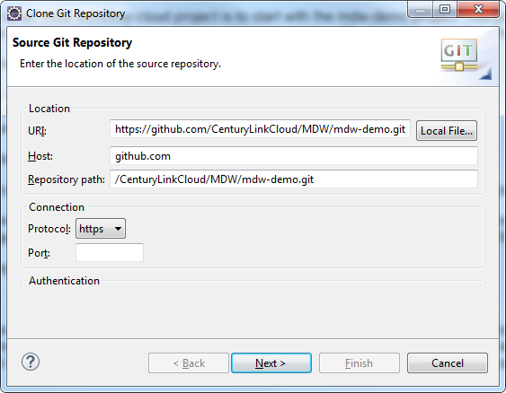
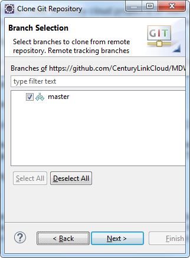
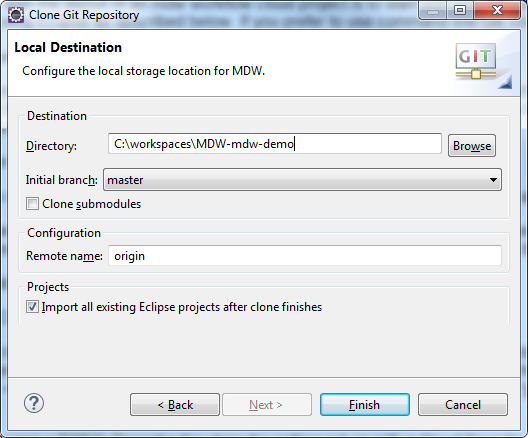

### MDW Cloud Foundry Cookbook

### Prerequisites
 - Eclipse Neon for JavaEE Developers:  
   http://www.eclipse.org/downloads
 - Required Plugins:
     - MDW Designer:                                                                         
       http://centurylinkcloud.github.io/mdw/docs/designer/updateSite
     - Buildship Plugin:   
       http://download.eclipse.org/buildship/updates/e46/releases/2.x
 - Running MDW Locally:
     - Refer to `Tomcat Container` in this tutorial 
 
### Running in the Cloud

#### 1. Clone the Demo Project from GitHub

A quick way to get familiar with the layout of an mdw workflow cloud project is to start with the mdw-demo project.    
This project is available from our GitHub instance of the CenturyLink.  You can clone this easily using Eclipse as described below.  If you prefer to use command line Git, clone the repository from
   [https://github.com/CenturyLinkCloud/mdw/mdw-demo.git](https://github.com/CenturyLinkCloud/mdw/mdw-demo.git). 

##### Clone the mdw-demo Project into Your Workspace:
-	Access the Git Repositories view by selecting Window > Show View > Other > Git > Git Repositories:
-	Copy the repository URL into your clipboard: `https://github.com/CenturyLinkCloud/mdw/mdw-demo.git`
-	Right-click in Git Repositories view and select Paste Repository Path or URI.

    

-	Click Next and make sure the master branch is selected:

    

-	Click Next again.  Point to your workspace/mdw-demo for the Destination Directory.  Check "Import all existing Eclipse projects after clone finishes".  Then click Finish.

     
　
##### MDW Designer Perspective:
-	To best view mdw-demo's workflow assets, switch to Designer Perspective (Window > Perspective > Open Perspective > Other > MDW Designer).
-	In Process Explorer view expand the mdw-demo project to see the included workflow packages.  These contain the assets that you'll deploy to Cloud Foundry in the following steps.

#### 2. Build and Deploy to Cloud Foundry

##### Build mdw-demo:
-	Switch to Java perspective in Eclipse so that the pom.xml Maven build file is visible in Package Explorer.
-	If you have the Eclipse Groovy plug-in installed, edit pom.xml to set the groovy.jar so that it points to the groovy-all jar file in your Eclipse installation. This is needed   
    so the Cucumber test cases that are executed during the build will not cause exceptions due to a Groovy version mismatch.   
-	Right-click on the pom.xml file and select Run As > Maven Build.  Enter "package" for the Goal.  Also on the JRE tab make sure a Java 8 runtime is selected as a minimum. 
  
##### Ensure Permissions:
-	Edit mdw-demo/config/seed_users.json to add yourself with permissions similar to the other users in the file.  Note: The default configuration uses an embedded MariaDB database for runtime persistence.  For non-dev environments, longer term persistence is required, and this can be accomplished using an external MariaDB or MySQL database configured in your manifest.yml descriptor.

##### Install Cloud Foundry CLI:
-	This tutorial uses the Cloud Foundry Command Line Interface:                              
  [https://cli.run.pivotal.io/stable?release=windows64&source=github](https://cli.run.pivotal.io/stable?release=windows64&source=github)

##### Cloud Foundry Development Tools in Eclipse:
-	Eclipse Neon comes with built-in Cloud Foundry support:                               
 	[https://projects.eclipse.org/projects/ecd.cft](https://projects.eclipse.org/projects/ecd.cft)

##### Perform a `cf push` to deploy mdw-demo:
-	Note: The following examples use the MDW demo deployment in CenturyLink's AppFog cloud environment.  See the Cloud Foundry Dev Guide, or type `cf help` for details about the available commands. 
-	A Cloud Foundry deployment is configured primarily through a manifest.yml file in the project root directory.  Take a look at the `manifest.yml` in mdw-demo, and note that it stipulates the MDW buildpack through its Git repository URL.  The settings you'll likely need to configure in this file are as follows:
    - `MDW_VERSION` - Whichever version of the MDW framework you're using (must be available as a buildpack).
    - `mdw.database.ur` - Only if you're using an external database rather than embedded.
    - `mdw.hub.url` - This is the user-access app endpoint URL as reported after a successful push.  
    - `mdw.services.url` - The services endpoint.  In development this is the same as mdw.hub.url.

-	After you've installed the Cloud Foundry CLI, open a command-line window in the mdw-demo root directory.  Use the `cf login` command, then enter your credentials to log in to your cloud space:
 
- cf login -a https://api.useast.appfog.ctl.io -o MDWF
  (The -a parameter designates the API endpoint, and the -o parameter is the organization -- type `cf login -h` for details).
-	Now, to deploy the mdw-demo app simply type cf push: `cf push`
-	In another command-line session, you can tail the application logs by typing: `cf logs mdw-demo`
-	Once the push is complete, verify successful deployment by accessing MDWHub in your browser with a URL something like this: 
  [https://mdw-demo.useast.appfog.ctl.io/mdw](https://mdw-demo.useast.appfog.ctl.io/mdw)

##### Make a Change and Push Again:
-	In Eclipse switch to MDW Designer perspective and expand the MyServices.  Open the Employees.java Dynamic Java asset and edit the get() method of this REST service to expect your ID and return your employee information:
 
Note: This example service comes from the MDW Services Cookbook.
-	Save the file, incrementing its version, and type the `cf push` command again.
-	Once the push has completed, access the service in your browser through a URL like the following: 
     - http://mdw-demo.useast.appfog.ctl.io/mdw/Services/MyServices/Employees/your-cuid

### Running Locally
#### 1. Tomcat Container

It can quickly become tedious to build and push to Cloud Foundry every time you want to test a code change.  To deploy mdw-demo locally, you can run on Tomcat.  With a Tomcat server running locally, your changes can be hot-deployed so that pushes and server restarts are not required.

##### Supported Tomcat Containers:
-	Apache Tomcat 8:                                  
 	[https://tomcat.apache.org](https://tomcat.apache.org)

##### Create a Tomcat Server:
-	To execute a workflow process you need a server running with MDW deployed.  For debugging in Eclipse the easiest way to set this up is through a Web Tools Platform server instance.  From the menu select File > New > Other > Server > Server.  Click Next and select Apache > Tomcat 8.0 (MDW) from the options.  To be able to debug your Dynamic Java it's important that you select Tomcat 8.0 (MDW) instead of the standard Tomcat 8.0 Server.  The server name is arbitrary, so you can make is something friendlier than the default.
  
-	If you've not previously used a Tomcat 8 runtime in Eclipse, clicking Next takes you to a page where you specify your Tomcat location.  Make sure that the selected JRE is Java 1.8.
 
-	The final page of the New Server wizard is where you designate your workflow project to be deployed on the server.  After that, click Finish to create the server instance.
 
-	If the Servers view is not visible in your current perspective, from the menu select Window > Show View > Other > Server > Servers.  You should see your Tomcat 8 server in this view.  You can double-click the server to edit its configuration.  Expand the Timeouts section, change the start timeout value to 300 seconds, and hit `Ctrl-S` to save your changes.  Then close the editor.
 
#### 2. Deploy Locally

##### Run Tomcat:
-	Edit the following properties in `config/mdw.properties':
```
  mdw.asset.location - This is the directory path on your hard-drive where your assets are located.     
  mdw.git.local.path - The root directory of your mdw-demo Git project.     
  mdw.hub.user - You may have noticed the Java system property runtimeEnv in your server config, which is preset to "dev".  This property allows you to bypass authentication locally.  
```
-	Now that you've created the WTP server instance, the Servers view gives you a handy way to start and stop Tomcat.  And output is directed to the Eclipse Console view, where you can click on stack traces to open associated source code (including MDW Framework code and Dynamic Java).  Start your server in debug mode by right-clicking on it and selecting Debug (or use the icon in the Servers view toolbar).
-	The first time you start your server Tomcat explodes the mdw.war file in your deploy/webapps directory and caches the deployable content.  This can sometimes take a minute.  With the server running you should see MDW output in the Eclipse Console view.
Tip: When you upgrade to a new MDW build version in Eclipse, Designer automatically downloads the corresponding mdw.war file into your deploy/webapps directory.  If at any time you want to clean out the MDW deployment and start fresh, you can delete mdw.war and the exploded mdw directory (and for a very thorough cleansing you can even delete the Tomcat cache under deploy/work/Catalina/localhost/mdw).  Then you can deploy from scratch from Package Explorer view by right-clicking on your workflow project and selecting MDW Update > Update Framework Libraries.
-	You can confirm that MDW was successfully deployed by accessing MDWHub in your browser:                          
  [http://localhost:8080/mdw](http://localhost:8080/mdw)

##### Make and Test a Change:
-	Make another change to the Employees service.  After saving the asset in Designer, you should be able to access the service right away and see your changes at:                                             
  http://localhost:8080/mdw/Services/MyServices/Employees/your-cuid
-	Once you've implemented and tested a feature, you can deploy to the cloud using `cf push`.

##### Next Steps:
-	Check out some of the other MDW developer cookbooks:                              
 [http://centurylinkcloud.github.io/mdw/docs/help/cookbooks](http://centurylinkcloud.github.io/mdw/help)
-	Browse through the online help docs, which are the same as those in Eclipse:                             
 	  [http://centurylinkcloud.github.io/mdw/docs/help](http://centurylinkcloud.github.io/mdw/help)
-	The MDW JavaDocs:                                                     
      [http://centurylinkcloud.github.io/mdw/javadoc/index.html](http://centurylinkcloud.github.io/mdw/javadoc/index.html)
