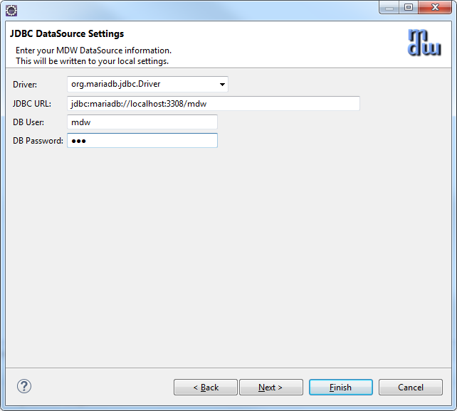
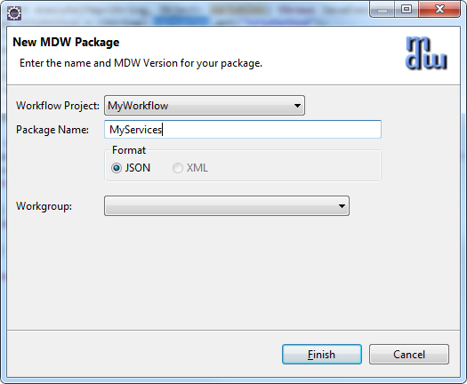
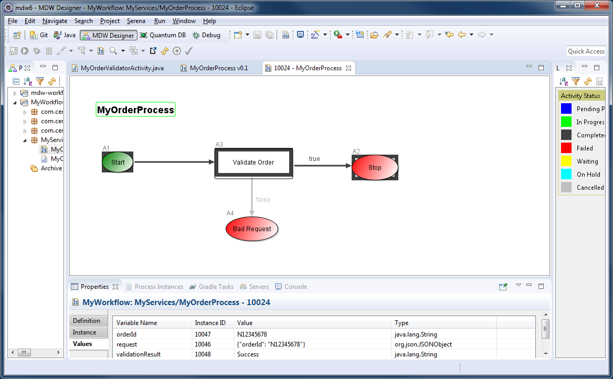
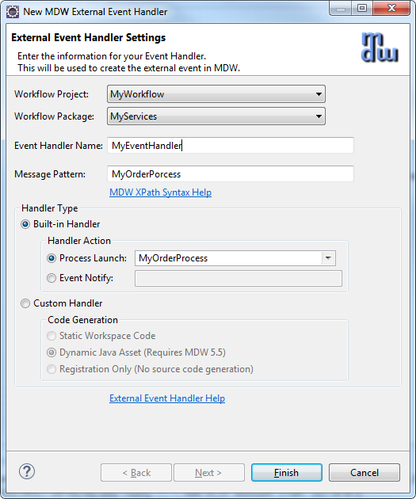
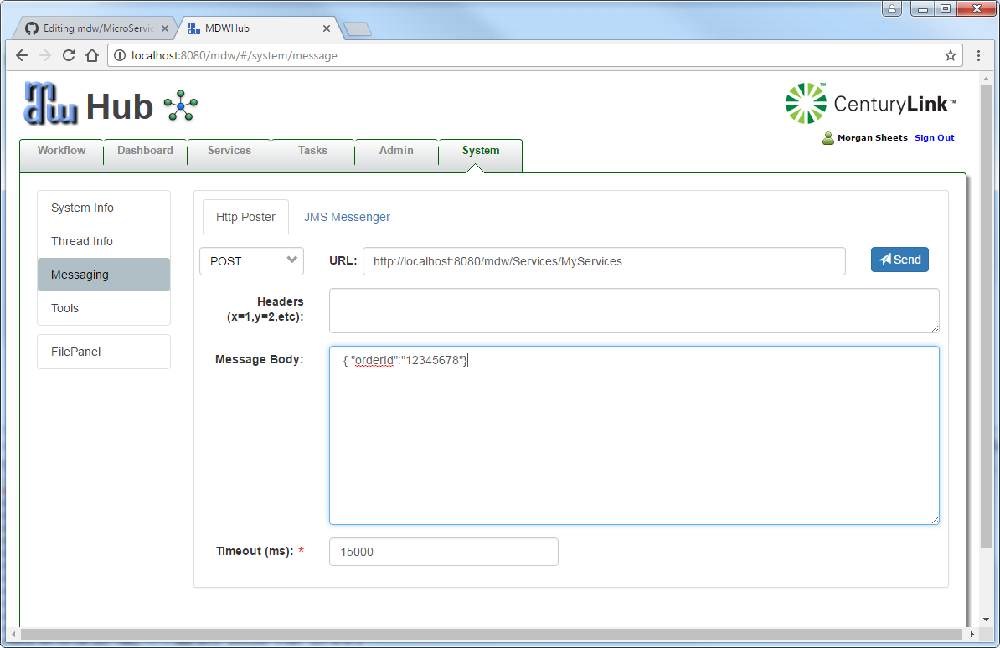
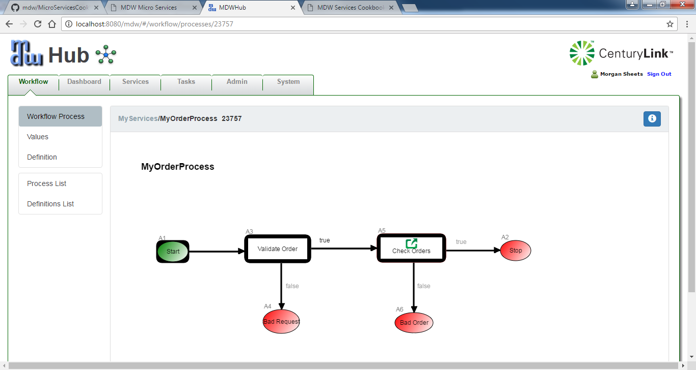
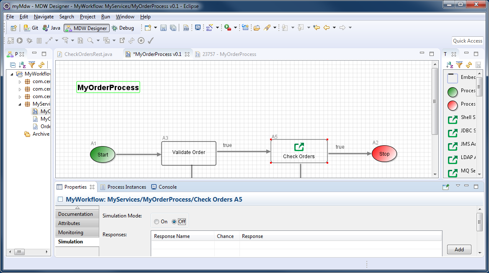
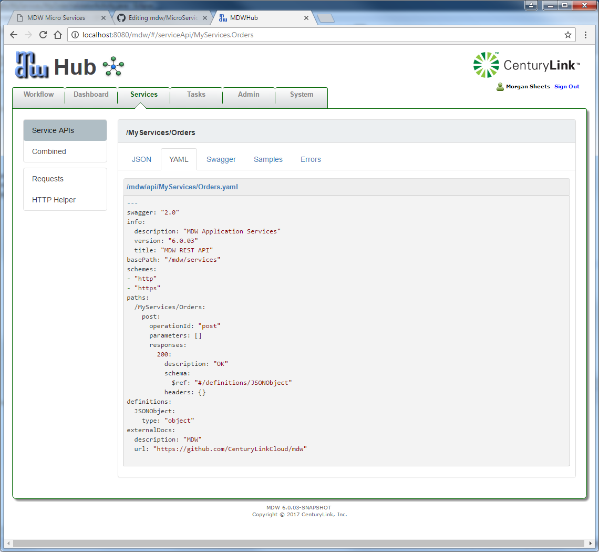

### MDW Micro Services 

This document contains information about creating, exposing and consuming services through a RESTFul Web Service. For a SOAP document-style Web Service, refer to [TomcatCookbook](TomcatCookbook.md).

### Prerequisites
 - Eclipse Neon for JavaEE Developers:  
   http://www.eclipse.org/downloads
 - Required Plugins:
     - MDW Designer:
       http://centurylinkcloud.github.io/mdw/docs/designer/updateSite
     - Buildship Plugin:   
       http://download.eclipse.org/buildship/updates/e46/releases/2.x
 - Recommended Plugins:
     - Groovy:                                   
       http://dist.springsource.org/snapshot/GRECLIPSE/e4.6
     - Yaml:                                             
       http://dadacoalition.org/yedit
 - Servers:
     - Refer to `Supported Java Containers` in this tutorial 
 - Chrome and Postman
     - https://www.google.com/chrome
	  - https://chrome.google.com/webstore/detail/postman/fhbjgbiflinjbdggehcddcbncdddomop

### Java Containers
You can perform many cloud development activities using a remote workflow project.  However, there are certain advantages to being able to deploy locally.  The differences between local and remote development are described in later sections of this tutorial.  To be able to develop locally you need one of the following containers installed.  At certain points in this tutorial, we'll link to container-specific steps in the Cookbooks for each supported container.

### Supported Java Containers: 
-	Apache Tomcat 8:
    - https://tomcat.apache.org
    - [TomcatCookbook](TomcatCookbook.md)
-   Pivotal Cloud Foundry 2.x:
    - http://pivotal.io/platform
    - [CloudFoundryCookbook](CloudFoundryCookbook.md)
 
### MDW Database:
- MDW saves the workflow assets you create on your local file system until you commit them to a version control repository such as Git.  Runtime data is stored in a MySQL or Oracle 
  database. Generally for cloud development you'll point to a pre-existing central database.  If you want to host your own database, you'll need to configure an instance of MySQL 
  with the MDW db schema. The SQL scripts for installing the MDW schema are available here: [this readme](../../mdw/database/mysql/readme.txt).
  
### Local Development:
#### 1. Create a Local Project
A local project is useful if you want to debug your custom Java source code and Groovy scripts.  The standard MDW war file is deployed as part of the steps outlined in this tutorial.

##### Open the Designer Perspective in Eclipse:
- Launch Eclipse (with the MDW Plug-In installed).
- From the menus select Window > Open Perspective > Other > MDW Designer.
- For detailed documentation covering the designer, refer to the [MDW Designer User Guide](../designer/DesignerUserGuide.md)
 
##### Launch the Local Project wizard:
- Right-click inside the blank Process Explorer view and select New > Local Project.  Select the Supported Java Container you'll be deploying in, and the type of [Asset Persistence](../help/assetPersistence.html)  you'll use.

  
- When you click Next, you'll be presented with the Tomcat for your local development.  Enter the settings for your environment.  For details about these settings, refer to the 
  server-specific cookbooks listed above under "Supported Java Containers" section.
  
  
- Click Next again and enter your database connection info.  The password for database is "mdw". 

  
  
- Click Finish to generate your local project.

### The MDW Base Package:
- When you create design artifacts in MDW, these are organized into workflow packages, which are different from Java packages in that they can contain assets in a wide variety of formats.  Much of the MDW framework's core functionality itself is delivered this way.  The essential assets required by MDW are included in the packages "com.centurylink.mdw.base" and "com.centurylink.mdw.hub".  If you choose the built-in database asset persistence, these base packages will already exist, and you can skip down to Section 2.  Otherwise, if you're using a new database or VCS asset persistence, you'll need to import these packages locally from the MDW repository as follows.
- Expand your newly-created workflow project in Process Explorer and you'll see that it currently contains no packages.  Right-click on the project and select Import > Package.  Choose the "Discover" option and leave the repository location as the default.

  

- After you click Next it'll take a few moments for Designer to locate the available packages.  Once these are displayed, expand both the base and the hub packages and select the same MDW version as you did when creating the project.

  
- Click Finish, and the packages will be downloaded and become visible in your Process Explorer project tree.
 
### Workflow Services

#### 2. Create a Service Process
##### Create a Workflow Package:
- The top-level branches in the Process Explorer project tree represent workflow packages.  Your work should be incorporated in a dedicated package, which will be used for managing resources and for insulating your work from that of other users.  For further details refer to the Eclipse Cheat Sheet (Help > Cheat Sheets > MDW Workflow > Importing, Exporting and Versioning).
- Create your workflow package by right-clicking on your project and selecting New > MDW Package.  Note: make sure your package name complies with Java package naming requirements (eg: no spaces) since it will contain dynamic Java resources.  Leave the Workgroup dropdown blank.

   

##### Create the Service Process:
-  Right-click on your new package in Process Explorer and select New > MDW Process.  Enter the process name and description (no workgroup), and click Finish.

   
 
-  After your process is created, double-click on the process title or on a blank area somewhere in the canvas to display the Properties View.  Select the Design properties tab and check "Service Process" to identify MyOrderProcess as a synchronous process returning a response. 

   
 
##### Add some Process Variables:
-  The convention in MDW is that a service request variable is named "request" and a service response variable is named "response".  There's the option to name these differently, but for simplicity let's go along with the convention here.  On the Variables property tab, create these two variables in your process with type org.json.JSONObject.  Set the mode for the request variable to be Input, and the mode for the response to be Output.  Add an Input String variable called orderId.

   
   
- Save your process design by selecting File > Save from the menu (or by clicking the disk icon in the Eclipse toolbar, or by typing ctrl-s).  Elect to overwrite the current version and to keep the process locked after saving.  During iterative development for convenience you'll sometimes overwrite the existing version of a process definition.  However once you've exported to another environment you'll want to increment the version since you cannot re-import a changed process with the same version number.  Details are covered under Help > Cheat Sheets > MDW Workflow > Importing, Exporting and Versioning.  

   

##### Create a Dynamic Java Custom Activity:
- Right-click on your package in Process Explorer and select New > Activity > General Activity.
- On the first page of the wizard, enter a label to identify your activity in the Toolbox view.

   
   
- Click Next and enter a class name for your activity implementor. The Java package name is the same as your workflow package name.

   
   
- When you click Finish the Java code for a skeleton implementation is generated. You’ll also see the Java class under your package in Process Explorer. 
- This source code resides under src/main/workflow and is known as a Dynamic Java workflow asset. It’s dynamic because it can be changed without needing any kind of application deployment. Naturally there are rigorous controls in place to prevent unauthorized modifications.
- In step 1 you were granted permissions in the MDW Demo environment to create and modify workflow assets.
- With Dynamic Java, as with all types of workflow assets, MDW provides facilities for versioning, rollback and import/export for migrating between environments.

- Update the generated Java source code to resemble the following:
```java


package MyService;
import com.centurylink.mdw.common.utilities.logger.StandardLogger.LogLevel;  
import com.centurylink.mdw.common.utilities.timer.Tracked;
import org.w3c.dom.Document;
import org.w3c.dom.Node;
import com.centurylink.mdw.activity.ActivityException;
import com.centurylink.mdw.model.value.activity.ActivityRuntimeContext;
import com.centurylink.mdw.workflow.activity.DefaultActivityImpl;
@Tracked(LogLevel.TRACE)
public class MyOrderValidatorActivity extends DefaultActivityImpl {
	@Override
	public Object execute(ActivityRuntimeContext runtimeContext) throws ActivityException {
		loginfo("Validating order...");
		boolean valid = false;
		try {
			JSONObject jsonObj = (JSONObject) getVariableValue("request");
	      		String orderId = (String) jsonObj.get("orderId");
	      		setVariableValue("orderId", orderId);
	      		String msg = "Success";
	      
	      		if (!jsonObj.has("orderId")){
				msg = "Missing order ID.";
   	      		}
            		else if (!Character.isDigit(orderId.charAt(0))) {
		    		msg = "Order ID must begin with a digit.";	        
            		}
			valid = msg.equals("Success");
	      		setVariableValue("validationResult", msg);
	  	} catch (Exception ex) {
	  		throw new ActivityException(ex.getMessage(), ex);
	  	}
	  	return valid;
	}
  }
  ```
- Now if you switch back to your process the new activity should appear in the Toolbox View. From the toolbox, drag your activity onto the canvas and insert it into your process flow between the Start and Stop activities.
- Tip: To draw a link (or transition in MDW terminology) between activities on the designer canvas, hold down the Shift key on your keyboard, Click on the upstream activity, and continue holding down the mouse left click button while dragging the cursor to the downstream activity (“shift-click-drag”).
- Your activity can be dragged like this and used in other processes designed by other users. Actually the proper term in MDW for this reusable element in the Toolbox is activity implementor. This conveys the idea that it’s actually a template to be dragged and configured as an activity in the canvas, and it also conveys the fact that it always corresponds to a Java class. To take this reuse concept a step further, your activity implementor can be made discoverable so that it can easily be imported into other environments and reused across domains. If you click on the light bulb icon at the top of the Toolbox you’ll get an idea how items in the palette can be imported from a file or discovered in the corporate repository.
- Double click the activity in the canvas, and in its Definition property tab change the label to something like “Validate Order”. When you click back on the canvas the activity reflects its new label.

   
   
- Note: If you select the Design property tab for your activity you’ll see that it’s blank. A non-trivial activity would allow certain aspects (such as endpoint URLs) to be configurable, so that it could readily be reused. For example, take a look at the Design tab for the Start activity. You control what appears on the Design tab through the pagelet XML for the activity implementor. In the creation wizard we left the pagelet XML blank, so the Design tab for our activity is empty. But to continue with the example of the start activity, find the Process Start icon in the Toolbox and view its Design tab (for the implementor, not the activity on the canvas). This gives you an idea of how the pagelet XML relates to the fields on the Design tab for the activity user. Since we’re on the subject you may be interested to know how you can customize the icon for your activity implementor. On the Definition tab you can choose one of the built-in shapes, or more flexibly choose any GIF, JPG or PNG asset that you can easily add to your workflow package.

##### Add Multiple Activity Outcomes:
- Drag a Process Finish activity from the Toolbox, and add another outbound transition from “Validate Order”. Assign Result Code values of “true” and “false” to the respective transitions as illustrated below. Save your process definition. The value passed in setReturnCode() in your activity’s execute() method dictates which of these two paths will be.

   

##### Get Your Server Running:
- Depending on which supported container you're using, you can follow one of the server setup exercises.  You'll need to follow the steps from one of these guides to the point where MDW is deployed and you're able to start and stop your server from the Eclipse Servers view. 
    - Tomcat Server Setup
    - Cloud Foundry Setup
- You can confirm that MDW was successfully deployed by accessing MDWHub in your browser:
     - Tomcat:  http://localhost:8080/mdw
 
- Troubleshooting: if you encounter an exception like below, it means you need to download the JCE 8 Unlimited Strength Jurisdiction Policy Files for JRE 1.8.  Or JCE 8 Unlimited Strength Jurisdiction Policy Files  for JRE 1.8
 
	    java.security.InvalidKeyException: Illegal key size or default parameters
 
##### Open the Process Launch Dialog:
- Right-click on the MyOrderProcess process in Process Explorer view and Select Run.  Designer will present the launch dialog and open a connection to the server to confirm that it's running (required for launching a process).
- On the Process tab in the launch dialog, select "Monitor Runtime Log" and "Process Instance Live View" to get a feel for how you can watch your process flow in real time.

  
 
##### Populate the Input Variable:
- Select the Variables tab in the launch dialog, and populate the orderId input.

  
 
##### Launch and View an Instance:
- Click Run on the launch dialog to run an instance of your process.  In the Live View you should see the new instance progress down the happy path with the Validate Order outcome equal to 'true'.  For processes not displayed in Live View, you can open an instance manually by right-clicking on your process in Process Explorer view and selecting View Instances.  The latest instance will appear at the top of the Process Instances list, and you can double-click to open its runtime view. 

- In Designer Perspective, a legend appears showing what the borders surrounding the activities mean.  To inspect the runtime variable values for the instance, click the Values property tab.

  
 
##### Register an External Event Handler:
- The lookup you just performed took a simple string input and returned nothing.  A real service would likely take an XML or JSON document as input, and return something similar with the results.  To expose this process as a service you'll need to register an External Event Handler.  An External Event Handler is the MDW mechanism for performing content-based routing of incoming requests to your service process.  So in our example it's a way of specifying that an JSON payload like the following should be routed to the MyOrderProcess service process:
  ```json
  { "orderId":"12345678"}
  ```
- To create an Event Handler, right-click on your MyServices package in Process Explorer and select New > Event Handler > External Event Handler and populate the wizard page as illustrated.  The Message Pattern in this case represents an XPath expression that tells MDW that matching requests should go through this handler.  The built-in Process Launch handler simply runs an instance of the selected process, passing along the request document.
Note: If you're using a shared database you'll want to make your Message Pattern unique.

  

-  Click Finish, and you should see the Event Handler appear under your package in Process Explorer.  You can view and edit details on the Definition properties tab for the handler.
- Run your process again, but this time use the External Event tab to specify a JSON value like the following.  This tells Designer to send a REST request to MDW with the designated payload

  
  
-  After launching, if you view the values for your latest instance you'll see that the request variable was correctly populated with the incoming payload, but the MyOrderProcess returned nothing because this time orderId was not populated.  There are many ways in MDW to pull values from a request document and use them in workflow activities like the LDAP adapter.  For simplicity we'll use the XPath binding feature in the process start activity.

##### Map an Input Variable Binding:
- On the Design tab for the Start activity in your process, enter a Binding Expression value of xpath:/MyOrderProcess/orderId mapped to the orderId input variable.

  

#### 3. Expose as a RESTFul Web Service
At this point your process is already exposed through all the protocols that MDW supports (the default behavior).  When you tested it above using Designer you were consuming it over the REST interface.  
 
##### Invoke Your Service through REST:
- If you're familiar with a tool like Postman, you can use that to create and send a request for your service.  The MDWHub System tab also includes the HTTP Poster utility that you can use to test your service.  Access MDWHub in your browser through a URL like this: [http://localhost:8080/mdw](http://localhost:8080/mdw).
- Click on the System tab, Messaging and the HTTP Poster. This is the default behavior. If you don't see the System tab you'll need to be granted Site Admin permissions for the environment where you're testing.  The submittal URL for HTTP Poster defaults to the MDW REST endpoint and the Message Body with something like the following:
  ```json
   { "orderId":"12345678"}
  ```        
- On the MDWHub System tab you can use the HTTP Poster to submit to the REST endpoint as illustrated below.
   
   
- Click on the Send, and your service process should be executed and you should see a response like in this screenshot:
   
 
##### Create the Response:
- The response output variable has so far remained unpopulated.  There are innumerable ways to build a response, and in a real-world service this might be cumulative based on multiple workflow steps.  To keep this exercise simple we'll use a PostScript on the LDAP Adapter activity we already have.  On the Script tab for this activity, move the response variable over to the Writable column.  Then make sure the selected PostScript language is Groovy, and click the Edit Script link.  Write a script like the following to populate the response:

```groovy
response = " { "orderId":"12345678"}"
```

-  Notice that process variables are implicitly available and assignable from within your script.  Notice also that we're building a string here, which MDW automatically translates to the appropriate type (org.w3c.dom.Document).  Save the script content and also the process.  If you run the process again through the event handler you should see the correct response in the Eclipse console, and the values should be correctly populated for the instance.
  
#### 4. Consume a RESTFul Web Service
MDW comes with Adapter activities for consuming services over many protocols from within your workflow processes.  In this exercise we'll use the REST Service Adapter activity to invoke the MyOrderProcess service you just created.
 
##### Create a Process with a REST Service Activity:
- Open the same process definition you started building in the sections above.  Add another String variable called employeeId.  Edit the code in your order validation activity to set employeeId from the request:

  ```java
  String employeeId = (String) jsonObj.get("employeeId");
  setVariableValue("employeeId", employeeId);
  ```
- Create a new process to consume your service.  From the Toolbox view drag a RESTful Service Adapter onto the canvas and insert it into your process flow. Label the web service activity "Check Employee", and give it two separate outcomes corresponding to true and false, just like the validation activity.
   
   
- On the Design tab for the web service activity, set the HTTP Method to POST and enter the same REST endpoint URL you used for testing your service in Section 3.  [http://localhost:8080/mdw/Services/REST](http://localhost:8080/mdw/Services/REST)


##### Add Pre and Post Script:
- With the REST activity in a real-world workflow, you might bind document variables to the service input and output through the Request Variable and Response Variable dropdowns pictured above.  To simplify this tutorial, let's take advantage of the Pre and Post script to build the request and pull values out of the response.  On the Script property tab for the Invoke MyOrderProcess activity, edit the prescript, adding the Groovy code below to return the request JSON posted to the service (if you've installed the Groovy Eclipse plugin you'll get syntax highlighting and autocomplete):

  ```groovy
  return                                                     
    TBD
  ```
  
- Edit the postscript as follows:                                              
  ```groovy                                                                                 
    TBD
  ```
  
##### Save and Run Your Process:
- Launch your process, entering employeeId on the process launch Variables tab.  View the instance to confirm that employeeName was populated as expected.
- In the process instance view, double-click the Invoke MyOrderProcess activity instance.  Then on the Instance property tab, double-click on the activity instance row.  The Activity Instance dialog shows you the raw request and response values that were sent over the wire.  
   
 
##### Stub Mode and Response Simulation:
- At times when performing services orchestration using MDW you may be designing a flow before one or more of your consumed services is not yet available.  Or you may not be ready to make an actual call because you're still debugging your workflow.  For situations like this MDW provides Stub Mode and Response Simulation.  Stub Mode is for local development and Automated Testing.  Response Simulation is used to hardwire the responses for specific adapter activities within a given environment.  Both of these features are accessed via the Simulation property tab.  Click this tab for the Invoke Check Employee REST adapter in the process you just build.  To try out Stub Mode, depress the Stub Server button (no need to Configure since the defaults should be fine).

   
   
- Note that this is a global setting; meaning once the stub server's running it intercepts all adapter activity requests.  Note also that it can be difficult to determine whether the button is depressed (i.e. stubbing is on).

- Once you've got stub mode turned on, run the process again and you'll be presented with a dialog prompting you for the desired response for this case.

   
   
- Whatever is typed in the Response Message textbox will be returned to your process as the adapter response, and you should be able to confirm this by checking the runtime values of the process instance.
- To simulate a response, disable the stub server and instead set Simulation Mode to On.  Then provide a Return Code (not currently used), Chance (weighted probability when multiple responses), and Response value for each different hardwired response scenario.

   

- These simulated response settings are meant to be per-environment, so they don't get saved with the process definition but rather as so-called "override attributes".  For this reason there's a Save button directly on the Simulation property tab.

#### JAX-RS Web Service
#### 1. Implement a JAX-RS Web Service

Besides implementing services by way of an MDW workflow process, you can easily expose your Dynamic Java class as a REST service using JAX-RS annotations.
 
##### Create a Java Asset to Implement a Resource Service:
- Right-click on your package in Process Explorer view and select new > Java Source.  By convention the Java class name will also be the name of your service resource.  Also by convention your workflow package name is the root of the REST endpoint URL path that consumers will use to access your service.  For this simple example we're using the myPackage.  In a real-world app you'll probably use a qualified package name like com.centurylink.my.services, and in that case you can specify a simplified URL path through the JAX-RS Path annotation, which will be illustrated later.
  
  

- Implement a REST service, using the JAX-RS @Path annotation and extending the MDW JsonRestService class:
     
  ```java
       package MyService;
       import java.util.Map;
       import javax.ws.rs.Path;
       import org.json.JSONException;
       import org.json.JSONObject;
       import com.centurylink.mdw.common.service.ServiceException;
       import com.centurylink.mdw.model.user.User;
       import com.centurylink.mdw.services.rest.JsonRestService;
       @Path("/Employees")
       public class Employees extends JsonRestService {
          @Override
          @Path("/{id}")
          public JSONObject get(String path, Map<String,String> headers) throws ServiceException, JSONException {
             String id = getSegment(path, 2);
             if ("dxoakes".equals(id)) {
                User emp = new User(id);
                emp.setName("Donald Oakes");
                emp.setAttribute("Email", "donald.oakes@centurylink.com");
                emp.setAttribute("Phone", "303 992 9747");
                return emp.getJson();
             }
             else {
                return null;
             }
         }
      }
  ```    
- Access your service using a GET request from your browser with a URL like the following:
    
    - [http://localhost:8080/mdw/Services/MyService/Employee/dxoakes](http://localhost:8080/mdw/Services/MyService/Employee/dxoakes)
 
##### Add Create Capability to Your REST Service:
- In the REST paradigm, creates are performed via HTTP POST.  So to implement the ability to add a new Employee, override the post() method:
     
  ```java
       @Override
       protected JSONObject post(String path, JSONObject content, Map<String, String> headers)
                    throws ServiceException, JSONException {
           User emp = new User(content);
           String id = emp.getCuid();
           if (id == null)
              throw new ServiceException(HTTP_400_BAD_REQUEST, "Missing user id");
           if (id.equals("ab64967"))
              throw new ServiceException(HTTP_409_CONFLICT, "Employee id exists: " + id);
           
           // TODO: actual work to create the employee
           System.out.println("Creating user: " + emp.getJson().toString(2));
           return null; // null indicates successful POST
       }
  ```
- Save your Dynamic Java asset, and use the MDWHub HTTP Poster tool to submit a POST request to add a new employee from your browser:
   
   
#### 2. Add Swagger API Annotations

With MDW REST services you can automatically generate Swagger documentation just by adding the appropriate annotations to your Dynamic Java.  This is not only a convenient way to maintain this documentation, but it also means that it's always up-to-date with the implementation.  Swagger documentation is a powerful way to communicate the specifics of your REST interface to potential consumers.  Swagger annotations represent a convenient mechanism for service developers to produce this documentation without having to hand-craft the JSON or YAML results.
 
##### Add the @Api Annotation to Your Service:
- The Swagger Api annotation goes on your class declaration along with the JAX-RS Path annotation.  The tag value in your annotation provides a high-level description of the its purpose:
  ```swagger
       @Path("/Employees")
       @Api("CenturyLink employees service")
       public class Employees extends JsonRestService {
         …
  ```
##### Add @ApiOperation Annotations to Your Methods:
- The ApiOperation annotation documents the specifics of a service endpoint operation, including any input or output model types.  The ApiImplicitParams annotation is useful for indicating the body content of a POST or PUT requests.  After adding these annotations to Employees.java, the code will look something like this:
  ```
       package myPackage;
       import java.util.Map;
       import javax.ws.rs.Path;
       import org.json.JSONException;
       import org.json.JSONObject;
       import com.centurylink.mdw.common.service.ServiceException;
       import com.centurylink.mdw.common.service.types.StatusMessage;
       import com.centurylink.mdw.model.user.User;
       import com.centurylink.mdw.services.rest.JsonRestService;
       import io.swagger.annotations.Api;
       import io.swagger.annotations.ApiImplicitParam;
       import io.swagger.annotations.ApiImplicitParams;
       import io.swagger.annotations.ApiOperation;
       @Path("/Employees")
       @Api("CenturyLink employees service")
       public class Employees extends JsonRestService {
          @Override
          @Path("/{id}")
          @ApiOperation(value="Retrieve an employee by their ID",
          notes="Currently only retrieves a single employee, and only dxoakes.", response=Employee.class)
          public JSONObject get(String path, Map<String,String> headers)
               throws ServiceException, JSONException {
               String id = getSegment(path, 2);
               if ("dxoakes".equals(id)) {
                  User emp = new User(id);
                  emp.setName("Donald Oakes");
                  emp.setAttribute("Email", "donald.oakes@centurylink.com");
                  emp.setAttribute("Phone", "303 992 9747");
                  return emp.getJson();
               }
               else {
                  return null;
               }
           }
    		@Override
    		@ApiOperation(value="Create an employee",
        	notes="Does not actually create anything as yet.", response=StatusMessage.class)
    		@ApiImplicitParams({
        		@ApiImplicitParam(name="Employee", paramType="body", dataType="MyServices.Employee")})
    			public JSONObject post(String path, JSONObject content, Map<String, String> headers)
    				throws ServiceException, JSONException {
       			User emp = new User(content);
        			String id = emp.getCuid();
        			if (id == null)
            			throw new ServiceException(HTTP_400_BAD_REQUEST, "Missing user id");
        			if (id.equals("dxoakes"))
            			throw new ServiceException(HTTP_409_CONFLICT, "Employee id exists: " + id);
        			
        			// TODO: actual work to create the employee
        			System.out.println("Creating user: " + emp.getJson().toString(2));
        			return null; // null indicates successful POST
    			}
			}
  ```
##### Add Swagger Annotations to the Employee Model Class:
- To enable consumers to easily create request content and interpret responses, you can annotate the related model objects so that they're discovered when documentation is generated.  In the Employee dynamic Java class, add the following class-level annotation:
  ```swager
      @ApiModel(value="Employee", description="Centurylink employee")
      public class Employee extends UserVO implements Jsonable {
      // Add your logic.

  ```
#### 3. View Generated REST APIs in MDWHub
MDWHub comes with a UI for displaying your generated Swagger API documentation, along with the standard MDW REST APIs.
 
##### Access the MDWHub Service API Page for Your Service:
- Open MDW in your browser and click on the Services tab.  Notice that API path for your service includes its package name to distinguish it from standard MDW services.
   

- Click on the /myPackage/Employees link.  The JSON and YAML tabs include the Swagger Spec API definitions for the Employees endpoint.  Click on the YAML tab to view a human-readable representation of your Employees API.  Notice that much of the information is provided by annotations from the MDW base service class.
   

- Scroll down to the "definitions" section to see the Employee model object definition as well as other referenced types.
- Now click on the Swagger subtab to explore the friendly swagger-editor UI for your service.
   
 
##### Add a Sample Request and Response:
- Sample payloads in MDW are by convention kept in an asset package under the service package whose name ends with "api.samples".  Each sample should be named to indicate its path and purpose, with an underscore separating these two parts.  Create a new MDW package named "myPackage.api.samples" and add a JSON asset named Employees_Get1.json with the following content:
  ```jason
     // GET request to services/myPackage/Employees/dxoakes
     {
     "cuid": "dxoakes",
     "name": "Donald Oakes",
     "attributes": {
       "Email": "donald.oakes@centurylink.com",
       "Phone": "303 992 9747"
     }
    }
  ```
- Add another asset named Employees_Create.json with content like this:
  ```json
     // POST request to services/MyServices/Employees
     {
      "cuid": "aa56486",
      "name": "Manoj Agrawal",
      "attributes": {
        "Email": "manoj.agrawal@centurylink.com",
        "Phone": "303 992 9980"
      }
    }
  ```

##### View the Samples in MDWHub:
- Now that your sample requests have been created in accordance with the MDW naming convention, they'll automatically be associated with the corresponding service path.  And they'll also be displayed in the Samples tab for your service in MDWHub:
   
