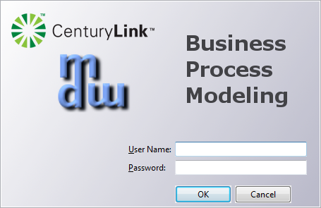

 

   
### MDW Designer RCP Install Guide

##### Note: These instructions are for installing Designer in a standalone mode.  

##### 1. Prerequisites
 - Required Plugin:
     - MDW Designer:
      [Installing and Upgrading the MDW Plugin for Eclipse](InstallAndUpgradeMDWPluginforEclipse)

##### 2. Designer Installation Steps
- Download the Installation Zip File from:  (..http://centurylinkcloud.github.io/MDW/docs/designer)
- Extract the Zip File Contents
- Right-click on the downloaded zip file in Windows Explorer and select Extract All…
- Extract into C:\Program Files or into the desired folder (the archive already contains an MDW subfolder):

##### 3. Run MDW Designer
- Double click on the file mdw.exe (or set up a shortcut pointing to C:\Program Files\mdw\mdw.exe.
- Log in using your LDAP user name and password:

  

##### 4: Get Started with MDW Designer
- MDW Designer User Guide: [Refer to the MDW Designer User Guide:](DesignerUserGuide)