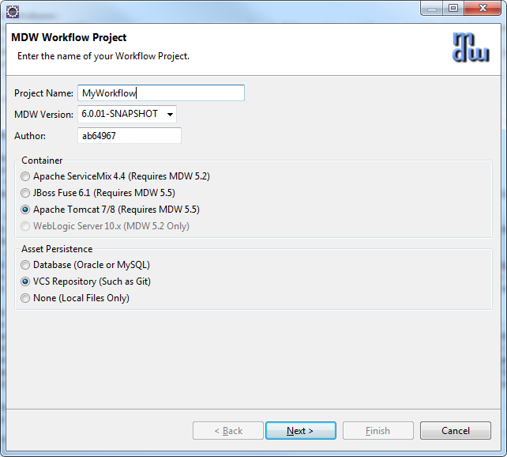
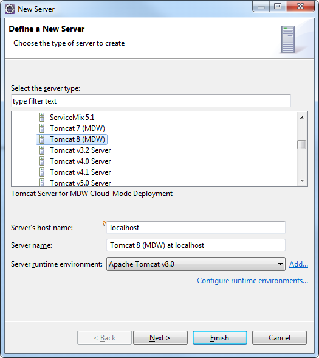
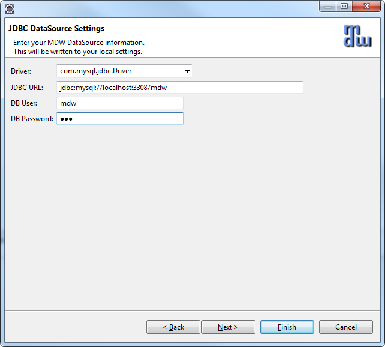
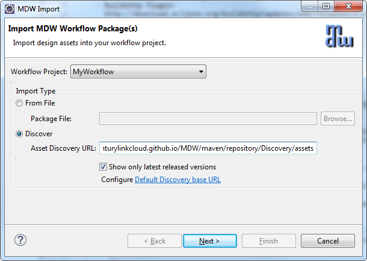
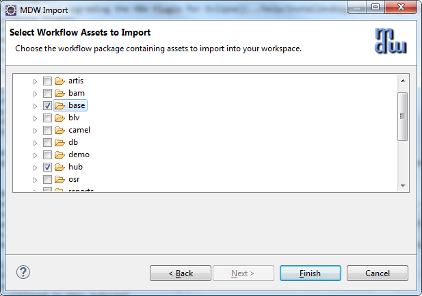
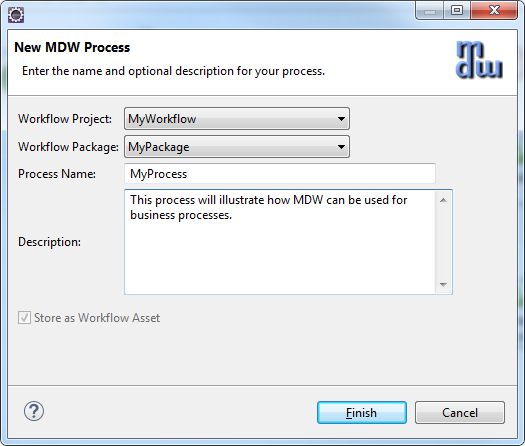
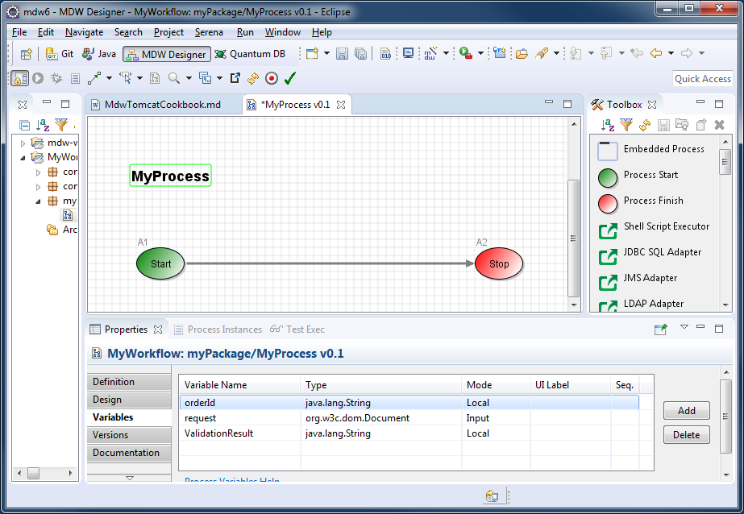
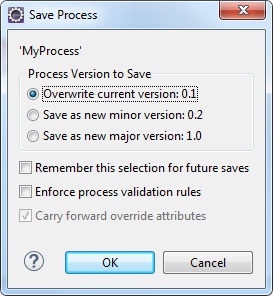
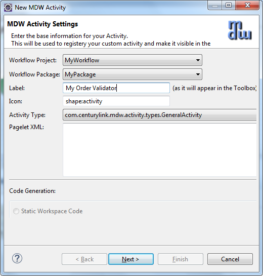
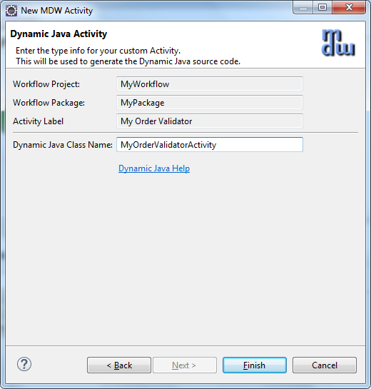

 
   
### MDW Tomcat Cookbook
### Prerequisites
 - Eclipse Neon for JavaEE Developers:  
   http://www.eclipse.org/downloads
 - Required Plugins:
     - MDW Designer:
      [Installing and Upgrading the MDW Plugin for Eclipse](InstallAndUpgradeMDWPluginforEclipse)
     - Buildship Plugin:   
       http://download.eclipse.org/buildship/updates/e46/releases/2.x
 - Tomcat 8:
     - https://tomcat.apache.org
 - Chrome and Postman
     - https://www.google.com/chrome
	 - https://chrome.google.com/webstore/detail/postman/fhbjgbiflinjbdggehcddcbncdddomop
### Supported Java Container (Apache Tomcat 8)  
You can perform many cloud development activities using a remote workflow project.  However, there are certain advantages to being able to deploy locally.  To be able to develop locally you need an Apache Tomcat: https://tomcat.apache.org.

### MDW Database:
- MDW saves the workflow assets you create on your local file system until you commit them to a version control repository such as Git.  Runtime data is stored in a MySQL or Oracle 
  database. Generally for cloud development you'll point to a pre-existing central database.  If you want to host your own database, you'll need to configure an instance of MySQL 
  with the MDW db schema. The SQL scripts for installing the MDW schema are available here: [this readme](../../mdw/database/mysql/readme.txt).
  

### Workflow Services

#### 1. Create a Local Project
A local project is useful if you want to debug your custom Java source code and Groovy scripts. 

##### Open the Designer Perspective in Eclipse:
- Launch Eclipse (with the MDW Plug-In installed).
- From the menus select Window > Open Perspective > Other > MDW Designer.
- For detailed documentation covering the designer, refer to the [MDW Designer User Guide:](../help/DesignerUserGuide.html)
 
##### Launch the Local Project wizard:
- Right-click inside the blank Process Explorer view and select New > Local Project.  Select Apache Tomcat as your Java container.  For Asset Persistence choose VCS (MDW 
  will create a local Git repo where it'll store the workflow metadata for your assets).
  
  
  
- Click Next.  Enter information about your Tomcat installation.  If you don't know what your Tomcat User password is, enter "tomcat".

  
    
- Click Next again and enter your database connection info.  The password for the database is "mdw".  

  

- Click Finish to generate your local project and download MDW into your Tomcat webapps directory.

##### The MDW Base Package:
- The design artifacts in MDW are known as workflow assets.  When you create processes or other assets these are organized into workflow packages, 
  which are different from Java packages in that they can contain assets in a wide variety of formats.  Much of the MDW framework's core functionality 
  is itself delivered as workflow assets.  The essential assets required by MDW are included in the packages "com.centurylink.mdw.base" and "com.centurylink.mdw.hub".  
  The first step in setting up your workspace is to import these packages locally from the MDW repository.
  
- Expand your newly-created workflow project in Process Explorer and you'll see that it currently contains no workflow packages.  
  Right-click on the project and select Import > Package.  Choose the "Discover" option and leave the repository location as the default.
  
  
 
- After you click Next it'll take a few moments for Designer to locate the available packages.  Once these are displayed, expand both the base package and 
  the hub package and select the same MDW version as you did when creating the project.
  
  
  
- Click Finish, and the packages will be downloaded and become visible in your Process Explorer project tree.

##### Create a Workflow Package:
- The top-level branches in the project tree represent workflow packages.  Your work should be incorporated in a dedicated package, which will be used for managing resources and for 
  insulating your work from that of other users.  For further details refer to the Eclipse Cheat Sheet (Help > Cheat Sheets > MDW Workflow > Importing, Exporting and Versioning).
- Create your workflow package by right-clicking on your project and selecting New > MDW Package.  Note: make sure your package name complies with Java package naming requirements 
  (eg: no spaces) since it will contain dynamic Java resources.  Leave the Workgroup dropdown blank. If you don’t see MDW Package when you right click your project, click File > New > 
  MDW Package from the top menu bar. 
  
  

#### Local Development

#### 2. Build Workflow Process

##### Create a Process:
- Right-click on your new package in Process Explorer and select New > MDW Process.  Enter the process name and description and click Finish. 
  If you don’t see MDW Process when you right click your new package, click File > New > MDW Process from the top menu bar.
  
  

##### Add some Process Variables:
- Double-click on the process title or on a blank area somewhere in the canvas to display the Properties View.  
  Select the Variables property tab and add an input variable (request) and two local variables (orderId and validationResult) with types as depicted below.
  
 
- Save your process design by selecting File > Save from the menu (or by clicking the disk icon in the Eclipse toolbar, or by typing ctrl-s).  
  Elect to overwrite the current version and to keep the process locked after saving.  During iterative development for convenience you'll 
  sometimes overwrite the existing version of a process definition.  However once you've exported to another environment you'll want to 
  increment the version since you cannot re-import a changed process with the same version number.  
  Details are covered under Help > Cheat Sheets > MDW Workflow > Importing, Exporting and Versioning.
  
  
 

##### Create a Dynamic Java Custom Activity:
- Right-click on your package in Process Explorer and select New > Activity > General Activity.  
  On the first page of the wizard, enter a label to identify your activity in the Toolbox view.
  
  
 
- Click Next and enter a class name for your activity implementor.  The Java package name is the same as your workflow package name.

  
 
- When you click Finish the Java code for a skeleton implementation is generated.  You'll also see the Java class under your package in Process Explorer.  
  This source code resides under src/main/workflow and is known as a Dynamic Java workflow asset.  It's dynamic because it can be changed without needing 
  any kind of application deployment.  Naturally there are rigorous controls in place to prevent unauthorized modifications.  
  In step 1 you were granted permissions in the MDW Demo environment to create and modify workflow assets.  
  With Dynamic Java, as with all types of workflow assets, MDW provides facilities for versioning, rollback and import/export for migrating between environments.
- Update the generated Java source code to resemble the following:
package MyPackage;
import com.centurylink.mdw.common.utilities.logger.StandardLogger.LogLevel;
import com.centurylink.mdw.common.utilities.timer.Tracked;
import org.w3c.dom.Document;
import org.w3c.dom.Node;
import com.centurylink.mdw.activity.ActivityException;
import com.centurylink.mdw.model.value.activity.ActivityRuntimeContext;
import com.centurylink.mdw.workflow.activity.DefaultActivityImpl;
/**
* MDW general activity.
*/
@Tracked(LogLevel.TRACE)
public class MyOrderValidatorActivity extends DefaultActivityImpl {
