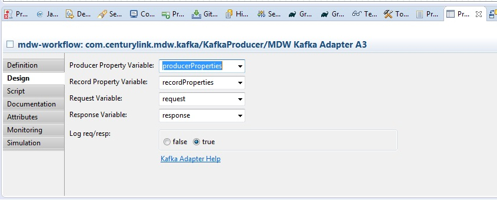

# Kafka Adapter and Listener

## Kafka Adapter Activity

The MDW Kafka Adapter Activity provides the ability to send a message on Kafka topic from a workflow process, binding the 
service Request and Response to process variables. It sends the message synchronously. Kafaka producer is created when first 
message is sent for the specific bootstrap servers. Every other instance of the Kafka adapter 
will use the same producer going forward because it is shared to speed up sending the messages. All the properties for 
producer and Records can be set using process variable of java.lang.Object type. Those needs to be set to Properties type. In the example included in the package you can look at the pre-script on the 
adapter to see how it can be done. The bootstrap server can be configured in a property file and can be read from there for in
 environment specific way.

## Setup

After importing this package, to enable Kafaka Listener(Consumer) and Adapter(Producer) capability, you can set the Adapter as shown in the pictures below
First you create process variables (name can be anything but they needs to be of java.lang.Object type)

```
producerProperties
recordProperties
```
  
Then you set these variables in design tab as shown below
  
  

Then you create a pre-script to set all the properties for Producer and Message record to be published as shown below
  

Here is the pre-script for the Adapter which sets the properties:

```
import java.util.Properties

import org.apache.kafka.clients.producer.ProducerConfig
import org.apache.kafka.common.serialization.LongSerializer
import org.apache.kafka.common.serialization.StringSerializer

import com.centurylink.mdw.config.PropertyUtil
import com.centurylink.mdw.constant.PropertyNames
import com.centurylink.mdw.kafka.KafkaAdapter

Properties producerProps = new Properties();

//NOTE: coma separated list of server:port ex. localhost:9092,localhost:9093
String server = PropertyUtil.getInstance().getPropertyManager().getProperty("mdw.kafka.servers");
System.out.println("BOOTSTRAP_SERVERS_CONFIG : " + server);
producerProps.put(ProducerConfig.BOOTSTRAP_SERVERS_CONFIG, server);
producerProps.put(ProducerConfig.CLIENT_ID_CONFIG, "KafkaMDWProducer");
producerProps.put(ProducerConfig.KEY_SERIALIZER_CLASS_CONFIG, LongSerializer.class.getName());
producerProps.put(ProducerConfig.VALUE_SERIALIZER_CLASS_CONFIG, StringSerializer.class.getName());
producerProperties = producerProps;

Properties recordProps = new Properties();
recordProps.put(KafkaAdapter.KAFKA_TOPIC_NAME, "kafkaTopic");
long key = System.currentTimeMillis();
recordProps.put(KafkaAdapter.RECORD_KEY, key);
recordProperties = recordProps;
```

## Kafka Listener

In order to configure MDW to register to listen for Kafka messages, your MDW instance will need to be configured via properties.   You may configure one or more listeners (Consumers) depending on your needs, and each listener can be set up to listen for one or more topics.   For each listener you configure, you may specify/overwrite any and all Consumer properties as listed in the Kafka Consumer API documentation, and MDW will provide a couple of defaults of its own as well, such as the Key and Value deserializer class. There are also a few MDW specific properties that can be specified that will provide you more flexibility in how you manage consumption/processing of Kafka records.

## Setup

After importing this package, to enable Kafaka Listener(Consumer), you will need to add the needed properties to your MDW properties file.   Each listener will need to have properties that follow this naming convention:

```
mdw.listener.kafka.<listenerName>.<propertyName>=<propertyValue>
```

Here is a simple example of how to configure a Kafka Listener named "AppKafkaListener1", which will register to listen for messages on topics "Topic1" and "Topic2":

```
mdw.listener.kafka.AppKafkaListener1.bootstrap.servers=vlddkafkats001.test.intranet:9092,vlddkafkats002.test.intranet:9092
mdw.listener.kafka.AppKafkaListener1.topics=Topic1,Topic2
mdw.listener.kafka.AppKafkaListener1.group.id=Topics1and2Group
mdw.listener.kafka.AppKafkaListener1.xmlWrapper=MyAppKafkaHandler
```

The above configuration will create a single Kafka consumer that will listen for 2 topics, auto-commit messages using the consumer's default settings, and use StringDeserializer class provided in the kafka-clients.jar for the Key and Value for all Kafka records it consumes.  The "xmlWrapper" property will wrap all incoming messages into an XML message having a root node of "<MyKafkaHandler>", which will allow you to then create/register an External Event Handler that will be used to process all messages whose root nodes are "<MyKafkaHandler>".  If you do not specify a "group.id" property, MDW will use a default value matching that of the listener name (i.e. in above example, if the group.id property were missing, the group.id would be "AppKafkaListener1".   If you do not specify the "topics" property, the listener will register to listen for a topic that matches the name of the listener (i.e. in above example, the topic would be "AppKafkaListener1" if the property were missing).

The following are additional properties that will impact how MDW handles the incoming messages:

```
mdw.listener.kafka.AppKafkaListener1.enable.auto.commit=false  (When set to "false", MDW will commit each message after it is processed, instead of the configured/default time interval for a Kafka Consumer)

mdw.listener.kafka.AppKafkaListener1.useThreadPool=true  (When set to "true", MDW will process each record in a separate thread, instead of using the Listener/Consumer thread to do the processing)
```
