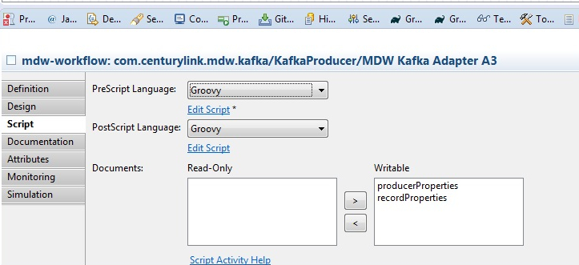

# Kafka Adapter and listener

## Kafka Adapter Activity

The MDW Kafka Adapter Activity provides the ability to send a message on Kafka topic from a workflow process, binding the 
service Request and Response to process variables. It sends the message synchronously. Kafaka producer is created when first 
message is sent for the specific bootstrap servers. Every other consumer 
will use the same producer going forward because it is shared to speed up sending the messages. All the properties for 
producer and Records can be set using process variable of java.lang.Object type. Those needs to be set to Properties type. In the example included in the package you can look at the pre-script on the 
adapter to see how it can be done. The bootstrap server can be configured in a property file and can be read from there for in
 environment specific way.

## Setup

After importing this package, to enable Kafaka Listen and Produce capability, you can set the Adapter as shown in the pictures below
First you create process variables (name can be anything but they needs to be of java.lang.Object type)

```
producerProperties
recordProperties
```
  
Then you set these variables in design tab as shown below
  
  

Then you create a pre-script to set all the properties for Producer and Message to be published as shown below
  

Here is the pre-script for the Adapter which sets the properties:

```
import java.util.Properties

import org.apache.kafka.clients.producer.ProducerConfig
import org.apache.kafka.common.serialization.LongSerializer
import org.apache.kafka.common.serialization.StringSerializer

import com.centurylink.mdw.config.PropertyUtil
import com.centurylink.mdw.constant.PropertyNames
import com.centurylink.mdw.kafka.KafkaAdapter

Properties producerProps = new Properties();

//NOTE: coma separated list of server:port ex. localhost:9092,localhost:9093
String server = PropertyUtil.getInstance().getPropertyManager().getProperty("mdw.kafka.servers");
System.out.println("BOOTSTRAP_SERVERS_CONFIG : " + server);
producerProps.put(ProducerConfig.BOOTSTRAP_SERVERS_CONFIG, server);
producerProps.put(ProducerConfig.CLIENT_ID_CONFIG, "KafkaMDWProducer");
producerProps.put(ProducerConfig.KEY_SERIALIZER_CLASS_CONFIG, LongSerializer.class.getName());
producerProps.put(ProducerConfig.VALUE_SERIALIZER_CLASS_CONFIG, StringSerializer.class.getName());
producerProperties = producerProps;

Properties recordProps = new Properties();
recordProps.put(KafkaAdapter.KAFKA_TOPIC_NAME, "kafkaTopic");
long key = System.currentTimeMillis();
recordProps.put(KafkaAdapter.RECORD_KEY, key);
recordProperties = recordProps;
```

## Kafka Listener

## Setup
